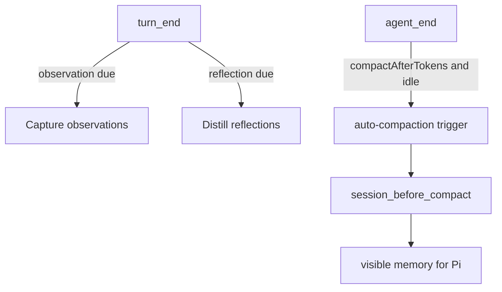

> [!IMPORTANT]
> **V3 update notice:** this extension now uses the new V3 memory model. If you used V2, update your `observational-memory` settings before running this version. V3 does **not** read the old V2 settings or memory format, and you should start a new clean Pi session after upgrading. See [Migrating from V2](#migrating-from-v2).

# pi-observational-memory

> **Make Pi sessions feel endless.**

`pi-observational-memory` is a Pi extension that keeps long agent sessions coherent across compactions, handoffs, and days of work.

It helps Pi remember what matters while you work, so your agent does not lose the thread when the session gets long.

Built for engineers who use Pi for real coding work: multi-day refactors, deep debugging sessions, architecture exploration, migrations, product implementation, and long-running branches where context matters.

---

## The problem

Long AI coding sessions eventually hit a wall.

Not because the agent stops being useful. Not because the work is too complex. But because the session starts getting compressed.

A compaction summarizes the session. Later, another compaction summarizes that summary. Then another. After enough cycles, your agent is no longer carrying the real working context. It is carrying a compressed version of a compressed version of a compressed version.

That is when the small but important details start disappearing:

* why a design decision was made
* what approaches were already rejected
* which constraint mattered most
* what the current branch is trying to achieve
* what the user already clarified
* what the agent already investigated
* what should not be reopened

The session is still alive, but it no longer feels connected to the work that came before.

For engineers, that is painful. Long coding sessions are built out of accumulated decisions. When those decisions lose their rationale, the agent starts drifting.

---

## The second problem: slow compaction

Compaction can also break flow.

You are deep in a coding session, the agent needs to compact, and suddenly you wait while a model rewrites the past. In large sessions, that pause can take minutes.

That interruption is costly because it happens exactly when the session is already complex and you most need continuity.

`pi-observational-memory` changes the experience: memory work happens as the session progresses, so when compaction time arrives, Pi can move forward quickly.

The goal is simple:

> When compaction happens, you should barely notice.

---

## What this extension gives you

`pi-observational-memory` continuously captures useful session memory while you work.

It focuses on two simple concepts:

### Observations

Observations are concrete things that happened or were established during the session.

Examples:

* the user decided to switch from REST to GraphQL
* the migration was completed and validated
* a bug was traced to a specific module
* a branch is focused on replacing one implementation with another
* a deadline, constraint, or preference was stated

Observations keep the session grounded in actual work.

### Reflections

Reflections are durable facts distilled from observations.

Examples:

* the user is building a Next.js 15 dashboard with Supabase auth
* the current implementation must ship by a specific date
* the project prefers minimal abstractions over framework-heavy patterns
* the branch is about improving long-session agent memory

Reflections help the agent stay oriented over time.

Together, observations and reflections let Pi carry the important parts of the session forward without depending on fragile summary chains.

---

## What it feels like

With `pi-observational-memory`, long sessions feel less like racing against the context window and more like working with an agent that can stay with you.

You can keep a session alive across many compactions. You can come back after a long break. You can hand work across sessions with less context loss. The agent has a better chance of remembering what was decided, what matters, and why the work is shaped the way it is.

This extension was built from real long-session usage, including Pi sessions that lasted for weeks without feeling close to the end of the usable working context.

The promise is not magic infinite memory.

The promise is practical continuity:

> Your agent keeps understanding the work, even after days of iteration.

---

## Why it works

Traditional compaction asks a model to rewrite the past at the moment the context window needs relief.

`pi-observational-memory` does the important memory work earlier, while the session is still happening.

As you work, the extension captures observations and distills reflections in the background. When Pi needs to compact, the memory is already prepared. Compaction becomes a fast rendering step instead of a slow summarization event.

That gives you two big benefits:

1. **Less coherence loss** — important context is preserved as observations and reflections instead of repeatedly compressed through summary chains.
2. **Faster compaction** — the expensive memory work happens before compaction, not while you are waiting.

---

## Example

At compaction time, Pi may receive memory like this:

```md
These are condensed memories from earlier in this session.

## Reflections
[a1b2c3d4e5f6] User works at Acme Corp building Acme Dashboard on Next.js 15 with Supabase auth.
[b2c3d4e5f6a1] Hard constraint: ship by January 22nd 2026.

## Observations
[d4e5f6a1b2c3] 2026-01-15 14:30 [high] User decided to switch from REST to GraphQL for the public API; motivation was reducing over-fetching on mobile clients.
[e5f6a1b2c3d4] 2026-01-15 14:50 [medium] GraphQL migration completed; user confirmed queries working.
```

The IDs are useful because the agent-facing `recall` tool can recover source evidence for a specific observation or reflection.

That means memory is not just a vague statement. The agent can look back at the evidence behind it.

---

## Who this is for

Use `pi-observational-memory` if you use Pi for:

* long coding sessions
* multi-day feature work
* architecture exploration
* large refactors
* production debugging
* repository migrations
* agent-assisted planning
* sessions that need to survive many compactions
* workflows where handoff quality matters

This extension is especially useful when the session contains decisions that should survive over time.

---

## Install

```bash
pi install npm:pi-observational-memory
```

Or install from GitHub/local development:

```bash
pi install git:github.com/elpapi42/pi-observational-memory
# or, from a local checkout:
pi install /absolute/path/to/pi-observational-memory
```

Pi loads the extension from `src/index.ts` through the package `pi.extensions` entry.

---

## Quick configuration

Settings live under the `observational-memory` namespace in either:

* `~/.pi/agent/settings.json`
* project-local `.pi/settings.json`

Project settings override global settings.

`PI_OBSERVATIONAL_MEMORY_PASSIVE` can override only `passive`.

A typical config:

```json
{
  "observational-memory": {
    "observeAfterTokens": 1000,
    "reflectAfterTokens": 5000,
    "compactAfterTokens": 50000,
    "observationsPoolMaxTokens": 30000,
    "agentMaxTurns": 16,
    "model": {
      "provider": "openrouter",
      "id": "google/gemma-4-31b-it",
      "thinking": "low"
    },
    "passive": false,
    "debugLog": false
  }
}
```

Most users can start with the defaults and tune only if they have a specific reason.

### Defaults

| Setting                     | Default       | Meaning                                                                                           |
| --------------------------- | ------------- | ------------------------------------------------------------------------------------------------- |
| `observeAfterTokens`        | `1000`        | Raw/source token threshold for observation runs.                                                  |
| `reflectAfterTokens`        | `5000`        | Raw/source token threshold for reflection and memory maintenance.                                 |
| `compactAfterTokens`        | `50000`       | Raw/source token threshold for proactive auto-compaction.                                         |
| `observationsPoolMaxTokens` | `30000`       | Visible observation-token pressure that triggers a full memory refresh during compaction.         |
| `agentMaxTurns`             | `16`          | Shared turn cap for background memory-agent loops.                                                |
| `model`                     | session model | Optional memory-worker model override: `{ provider, id, thinking }`.                              |
| `passive`                   | `false`       | Disables proactive background observation, reflection, maintenance, and auto-compaction triggers. |
| `debugLog`                  | `false`       | Writes extension debug events to Pi's agent directory.                                            |

Valid `model.thinking` values are:

* `off`
* `minimal`
* `low`
* `medium`
* `high`
* `xhigh`

If no `model` is configured, memory workers use the session model.

For details and tuning guidance, see [`docs/configuration.md`](docs/configuration.md).

---

## Commands and agent tool

| Surface             | What it does                                                                                                                                    |
| ------------------- | ----------------------------------------------------------------------------------------------------------------------------------------------- |
| `/om-status`        | Shows memory counts, visible/full drift, progress clocks, memory pressure, passive/in-flight state, and last worker errors.                     |
| `/om-view`          | Shows current visible memory: what the latest compaction made available to the agent.                                                           |
| `/om-view full`     | Shows the full current memory state for the branch.                                                                                             |
| `/om-view diff`     | Shows drift between visible memory and full memory.                                                                                             |
| `recall` agent tool | Recovers source evidence for a 12-character observation/reflection id on the current branch. It is not semantic search or a transcript browser. |

---

## How it works in 60 seconds



The high-level lifecycle:

1. Pi session continues normally.
2. The extension captures observations from the session as work happens.
3. Durable reflections are distilled in the background.
4. When compaction time arrives, Pi receives prepared memory quickly.
5. The agent continues with a compact but useful view of the work so far.

The important part: compaction does not need to rethink the whole session from scratch.

---

## Current V3 behavior

Current behavior:

* **Observation-centered memory.** The extension records useful session observations while you work.
* **Durable reflections.** The extension distills stable facts that help the agent stay oriented over time.
* **Fast compaction.** `session_before_compact` does not call a model or wait for background workers. It renders the current prepared memory state.
* **Background memory work.** Observation and reflection work run from `turn_end` when their token clocks are due.
* **Source-backed recall.** Observations and reflections can be traced back through the `recall` tool.
* **Visible/full/diff views.** `/om-view` shows visible memory, `/om-view full` shows the full current memory state, and `/om-view diff` shows visible-vs-full drift.
* **No V2 compatibility layer.** Old V2 settings and memory entries are ignored rather than migrated.

---

## Migrating from V2

V3 is **not backwards compatible** with V2 memory or settings.

What this means in practice:

1. **Update your settings.** V2 keys are silently ignored by V3. Keeping the old names will make V3 fall back to defaults.
2. **Start a new clean Pi session after upgrading.** Existing sessions may still contain old visible compaction-summary text until a new V3 compaction replaces what the agent sees, so a clean session is the safest migration path.
3. **Do not expect rollback continuity.** If you create V3 memory entries and then roll back to V2, V2 will not understand the V3 memory format. Treat that as memory reset/visibility loss.

### Settings migration table

| V2 setting                   | V3 setting                                              | What to do                                                                                                                                     |
| ---------------------------- | ------------------------------------------------------- | ---------------------------------------------------------------------------------------------------------------------------------------------- |
| `observationThresholdTokens` | `observeAfterTokens`                                    | Rename. Same rough role: observation cadence based on raw/source tokens.                                                                       |
| `compactionThresholdTokens`  | `compactAfterTokens`                                    | Rename. Same rough role: proactive compaction cadence.                                                                                         |
| `reflectionThresholdTokens`  | `reflectAfterTokens` and/or `observationsPoolMaxTokens` | Split. Use `reflectAfterTokens` for reflection scheduling. Use `observationsPoolMaxTokens` for visible observation-pool/full-refresh pressure. |
| `compactionModel`            | `model`                                                 | Move `{ provider, id }` to `model`.                                                                                                            |
| `thinkingLevel`              | `model.thinking`                                        | Move under `model`.                                                                                                                            |
| `observerMaxTurnsPerRun`     | `agentMaxTurns`                                         | Replace with the shared memory-agent turn cap.                                                                                                 |
| `reflectorMaxTurnsPerPass`   | `agentMaxTurns`                                         | Replace with the shared memory-agent turn cap.                                                                                                 |
| `prunerMaxTurnsPerPass`      | `agentMaxTurns`                                         | Replace with the shared memory-agent turn cap.                                                                                                 |
| `compactionMaxToolCalls`     | none                                                    | Remove. There is no V3 alias.                                                                                                                  |
| `passive`                    | `passive`                                               | Keep if desired.                                                                                                                               |
| `debugLog`                   | `debugLog`                                              | Keep if desired.                                                                                                                               |

Example V2 config:

```json
{
  "observational-memory": {
    "observationThresholdTokens": 1000,
    "compactionThresholdTokens": 50000,
    "reflectionThresholdTokens": 30000,
    "compactionModel": { "provider": "openrouter", "id": "google/gemma-4-31b-it" },
    "thinkingLevel": "low",
    "observerMaxTurnsPerRun": 8,
    "reflectorMaxTurnsPerPass": 12,
    "prunerMaxTurnsPerPass": 12,
    "passive": false
  }
}
```

V3 equivalent:

```json
{
  "observational-memory": {
    "observeAfterTokens": 1000,
    "reflectAfterTokens": 5000,
    "compactAfterTokens": 50000,
    "observationsPoolMaxTokens": 30000,
    "agentMaxTurns": 12,
    "model": {
      "provider": "openrouter",
      "id": "google/gemma-4-31b-it",
      "thinking": "low"
    },
    "passive": false
  }
}
```

---

## More docs

* [`docs/concepts.md`](docs/concepts.md) — vocabulary and V3 mental model.
* [`docs/how-it-works.md`](docs/how-it-works.md) — lifecycle, memory shapes, projections, and recall flow.
* [`docs/configuration.md`](docs/configuration.md) — all V3 settings and migration notes.

---

## Credits

Inspired by [Mastra's Observational Memory](https://mastra.ai/blog/observational-memory) research.

This is an independent implementation built for Pi's extension system.

---

## License

MIT
