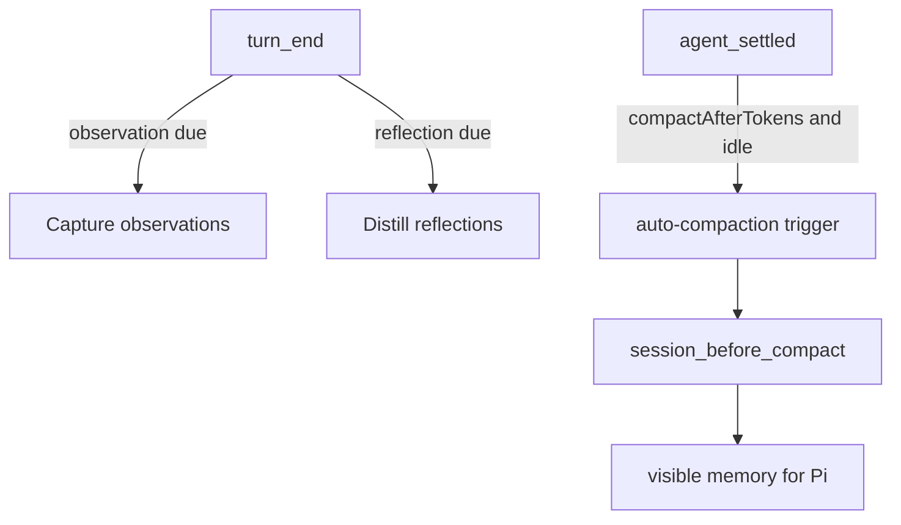

# @sovorn/pi-observational-memory

[](https://www.npmjs.com/package/@sovorn/pi-observational-memory)
[](https://pi.dev/packages/@sovorn/pi-observational-memory)
[](./LICENSE)

A Pi extension that keeps long-running conversations coherent across compaction. It records useful observations, distills durable reflections, removes redundant active observations when safe, and feeds bounded memory back into Pi's next context window.

This package is designed to be installed and used on its own. You do not need to install or read another repository.

## Quick start

Install it through Pi:

Requires Pi 0.81.0 or newer. Proactive compaction uses the `agent_settled` lifecycle event introduced in that release.

```bash
pi install npm:@sovorn/pi-observational-memory
```

Restart Pi after installation. The extension starts automatically with its defaults.

Check its state inside Pi:

```text
/om:status
```

View recorded memory:

```text
/om:view
```

Update it later through Pi:

```bash
pi update npm:@sovorn/pi-observational-memory
```

Or update all installed Pi packages:

```bash
pi update --extensions
```

The npm package does not have a separate update CLI. Installation and updates are managed by Pi.

## What it does

Long Pi sessions eventually need compaction: older conversation is removed from the active context and replaced with a shorter summary. Without memory support, important decisions, constraints, and user preferences can disappear during repeated compactions.

This extension prepares memory continuously:

1. **Observer** — reads new conversation content and records timestamped observations such as decisions, progress, constraints, completed work, and blockers.
2. **Reflector** — turns durable observations into long-lived reflections such as user preferences, project goals, technical decisions, rationale, and invariants.
3. **Dropper** — when the active observation pool is too large and reflection coverage exists, removes observations that are safe to treat as redundant. The ledger history is retained.
4. **Compaction** — supplies observations and reflections to Pi when the context is compacted.
5. **Recall** — memory entries have IDs so exact source evidence can be recovered when a compressed memory needs verification.

Normal observation and reflection recording continues to use its own background thresholds. This fork additionally limits how many reflection tokens are sent back into Pi during compaction.

## Reflection context control

The full reflection ledger is retained. Only the reflection representation sent into the active context is bounded.

```text
full reflection ledger
        |
        +-- older reflections -> rolling digest
        +-- newest reflections -> kept verbatim
        |
        +-- digest + recent reflections -> Pi context
```

The default reflection context budget is `10,000` tokens:

- 40% for a digest of older reflections
- 60% for the newest reflections kept verbatim

After each successful reflector batch, background maintenance checks the recent reflection window. When uncovered reflections exceed the 60% high-water allocation, older reflections are folded into a replacement digest until the recent suffix returns to the 40% post-update target. The remaining 20% is headroom for later reflector batches. The digest stores a watermark in a branch-local ledger checkpoint, and original reflections are never deleted.

The digest uses the same model and thinking level configured for the other memory workers and stops after one recording tool call. If generation fails, no checkpoint is appended and the watermark does not advance. Compaction never calls the model: it reads the latest valid checkpoint and renders any uncovered reflections directly.

## Configuration

Settings go under the `observational-memory` key in either:

- Global: `~/.pi/agent/settings.json`
- Project-local: `<project>/.pi/settings.json`

Project settings override global settings. Restart Pi after changing settings.

### Minimal useful configuration

Most users only need this:

```json
{
  "observational-memory": {
    "reflectionContextMaxTokens": 10000
  }
}
```

### Complete configuration

```json
{
  "observational-memory": {
    "observeAfterTokens": 10000,
    "reflectAfterTokens": 20000,
    "reflectionContextMaxTokens": 10000,
    "compactAfterTokens": 81000,
    "compactAfterTokensMode": "calibrated",
    "compactAfterTokensRatio": 0.68,
    "observationsPoolMaxTokens": 20000,
    "observationsPoolTargetTokens": 10000,
    "agentMaxTurns": 16,
    "model": {
      "provider": "openrouter",
      "id": "google/gemma-4-31b-it",
      "thinking": "low"
    },
    "showWorkerNotifications": true,
    "passive": false,
    "debugLog": false
  }
}
```

### Settings reference

| Setting | Default | What it controls |
|---|---:|---|
| `observeAfterTokens` | `10000` | How much new raw conversation accumulates before the observer runs. |
| `reflectAfterTokens` | `20000` | How much new raw conversation accumulates before the reflector runs. |
| `reflectionContextMaxTokens` | `10000` | Maximum reflection context sent into Pi during compaction. Internally split 40% digest and 60% recent reflections. |
| `compactAfterTokens` | `81000` | Proactive compaction threshold in calibrated mode. |
| `compactAfterTokensMode` | `"calibrated"` | Use `"calibrated"` for the fixed threshold or `"ratio"` to scale it to the model context window. |
| `compactAfterTokensRatio` | `0.68` | Context-window ratio used only in `"ratio"` mode. Must be between `0` and `1`. |
| `observationsPoolMaxTokens` | `20000` | Observation size at which full-fold/drop maintenance becomes relevant. |
| `observationsPoolTargetTokens` | `10000` | Target size for the active observation pool after maintenance. |
| `agentMaxTurns` | `16` | Maximum turns for observer, reflector, and dropper background workers. |
| `model` | session model | Optional model override with `provider`, `id`, and optional `thinking`. |
| `passive` | `false` | Set to `true` to disable proactive background memory and auto-compaction triggers. |
| `debugLog` | `false` | Enable local diagnostic logs under the Pi agent directory. |

### Which settings should I change?

By default `compactAfterTokensMode` is `"calibrated"`, so the proactive
compaction trigger uses the fixed `compactAfterTokens` estimated source-entry
threshold (81,000 by default). This preserves the pre-PR #40 compaction metric
for typical ~128K–200K context models.

- Want tighter context after compaction? Lower `reflectionContextMaxTokens`.
- Want more historical reflection detail? Increase `reflectionContextMaxTokens`.
- Want memory workers to run more often? Lower `observeAfterTokens` or `reflectAfterTokens`.
- Want fewer background model calls? Increase those thresholds.
- Want a cheaper memory model? Set `model`.
- Want to disable automatic background work? Set `passive` to `true`.

The normal reflection ledger is not limited by `reflectionContextMaxTokens`; that setting limits only what is fed back into the active Pi context.

## Model configuration

If `model` is omitted, observer, reflector, dropper, and reflection-digest maintenance use the current Pi session model.

To use a dedicated memory model:

```json
{
  "observational-memory": {
    "compactAfterTokens": 81000,
    "compactAfterTokensMode": "ratio",
    "compactAfterTokensRatio": 0.5
  }
}
```

In ratio mode the effective threshold is
`floor(model.contextWindow * compactAfterTokensRatio)` (clamped to a minimum of
1). With the example above, a 1,000,000-token window compacts after about
500,000 estimated source-entry tokens after the latest compaction boundary; a
200,000-token window uses about 100,000. The threshold counts source entries,
not Pi's system prompt, tool schemas, or provider accounting. Pi's native
window-pressure compaction remains independent.

`compactAfterTokensRatio` is user-tunable precisely because **context window ≠
attention**. Some models advertise a large window but degrade at long range; set
a lower ratio (e.g. `0.4`) to compact earlier on those, or a higher ratio
(e.g. `0.7`) on models that stay sharp. The default ratio is `0.68`.

`compactAfterTokens` is always retained as the fallback: in `"calibrated"`
mode it is the threshold directly, and in `"ratio"` mode it is used whenever
the active model's `contextWindow` is unavailable (undefined, 0, or negative),
so compaction still triggers safely. `/om:status` shows the resolved threshold
on the `Next compaction` line regardless of mode.

### Defaults

| Setting                     | Default       | Meaning                                                                                           |
| --------------------------- | ------------- | ------------------------------------------------------------------------------------------------- |
| `observeAfterTokens`        | `10000`       | Raw/source token threshold for observation runs.                                                  |
| `observerChunkMaxTokens`    | derived       | Max estimated tokens serialized into one observer chunk (minimum `256`). Unset: `floor(contextWindow * 0.2)` of the resolved memory model, or `60000` when the window is unknown. Larger backlogs drain oldest-first; a single over-budget source is sent as a marked head/tail excerpt while the original source remains in the session ledger. |
| `reflectAfterTokens`        | `20000`       | Raw/source token threshold for reflection runs; successful reflection creates dropper opportunities. |
| `compactAfterTokens`        | `81000`       | Estimated source-entry threshold for proactive auto-compaction, counted after the latest compaction boundary. |
| `compactAfterTokensMode`    | `"calibrated"`| `"calibrated"` uses `compactAfterTokens` directly. `"ratio"` scales the source-entry threshold by the active model's `contextWindow`. |
| `compactAfterTokensRatio`   | `0.68`        | In `"ratio"` mode, the threshold is `floor(contextWindow * ratio)`. Tunable because large windows do not always mean strong long-range attention. Must be in `(0, 1)`. |
| `observationsPoolMaxTokens` | `20000`       | Observation-token budget used for compaction full-fold pressure.                                  |
| `observationsPoolTargetTokens` | half of max | Active observation target used by post-reflection dropper maintenance.                            |
| `agentMaxTurns`             | `16`          | Shared turn cap for background memory-agent loops.                                                |
| `model`                     | session model | Optional memory-worker model override: `{ provider, id, thinking }`.                              |
| `showWorkerNotifications`   | `true`        | Shows routine observer, reflector, and dropper progress notifications. Warnings and errors are unaffected. |
| `passive`                   | `false`       | Disables proactive background observation, reflection, maintenance, and auto-compaction triggers. |
| `debugLog`                  | `false`       | Writes opt-in per-session extension debug events to Pi's agent directory.                         |

Valid `model.thinking` values are:

* `off`
* `minimal`
* `low`
* `medium`
* `high`
* `xhigh`
* `max`

If no `model` is configured, memory workers use the session model.

Set `showWorkerNotifications` to `false` to hide routine worker start and completion messages (including deliberate-empty observer info messages). Model fallback/unavailability, worker failures (including observer stream errors), compaction notifications, and explicit `/om:*` command output remain visible.

`observationsPoolMaxTokens` and `observationsPoolTargetTokens` intentionally describe different pools. Max tokens control when compaction performs a full fold over visible memory. Target tokens control the folded active observation pool that the dropper maintains after successful reflection. If the target is omitted, it defaults to half of max.

Dropper pruning balances age, relevance, and reflection coverage. Relevance is importance/resistance, not a permanent active-memory pin: `critical` observations require the strongest evidence but can be dropped when they are older and safely represented by reflections, superseded by newer memory, redundant, or obsolete. Dropper input annotates each active observation with deterministic coverage evidence: `none`, `partial`, or `strong`; coverage guides model judgment and is not an automatic drop rule. Dropping removes observations from active memory, not ledger history.

When `debugLog` is enabled, debug events are written as local NDJSON files under Pi's agent directory. Normal sessions write to `observational-memory/debug/<session-id>.ndjson`; contexts without a session id fall back to `observational-memory/debug.ndjson`. Debug rows include `sessionId` and per-consolidation `runId`, so a session file can still be filtered to one observer/reflector/dropper run.

For details and tuning guidance, see [`docs/configuration.md`](docs/configuration.md).

---

## Commands and agent tool

| Surface             | What it does                                                                                                                                    |
| ------------------- | ----------------------------------------------------------------------------------------------------------------------------------------------- |
| `/om:status`        | Shows memory counts, plain `+N` / `-N` visible/full drift suffixes, progress clocks, visible and active observation pool pressure, passive/in-flight state, and last worker errors. |
| `/om:view`          | Shows current visible memory and attempts to copy the rendered memory text to the clipboard.                                                   |
| `/om:view full`     | Shows the full current memory state for the branch and attempts to copy the rendered memory text to the clipboard.                             |
| `recall` agent tool | Recovers source evidence for a 12-character observation/reflection id on the current branch. It is not semantic search or a transcript browser. |

`/om:view` copies only the rendered memory content. The success/failure line shown in Pi is not included in the clipboard text. If clipboard support is unavailable, the command still prints the memory view and shows a warning. Before the first V3 compaction, visible memory can be empty because nothing has been folded into `om.folded` details; use `/om:view full` to inspect recorded branch memory.

---

## How it works in 60 seconds


```mermaid
flowchart TD
    Turn[turn_end]
    Observe[Capture observations]
    Reflect[Distill reflections]
    AgentSettled[agent_settled]
    Trigger[auto-compaction trigger]
    Compact[session_before_compact]
    Summary[visible memory for Pi]

    Turn -->|observation due| Observe
    Turn -->|reflection due| Reflect
    AgentSettled -->|compactAfterTokens and idle| Trigger --> Compact --> Summary
```

The high-level lifecycle:

1. Pi session continues normally.
2. The extension captures observations from the session as work happens.
3. Durable reflections are distilled in the background.
4. When compaction time arrives, Pi receives prepared memory quickly.
5. The agent continues with a compact but useful view of the work so far.

The important part: compaction does not need to rethink the whole session from scratch.

The proactive compaction threshold counts estimated source-entry tokens after
the latest compaction boundary. It includes source entries retained by
`firstKeptEntryId` and newer source entries, while memory ledger entries and
compaction metadata contribute zero. `/om:status` uses the same metric. Pi's
own window-pressure compaction remains independent.

---

## Current V3 behavior

Current behavior:

* **Observation-centered memory.** The extension records useful session observations while you work.
* **Durable reflections.** The extension distills stable facts that help the agent stay oriented over time.
* **Fast compaction.** When prepared V3 memory exists, `session_before_compact` renders it without calling a model or waiting for background workers. An empty V3 projection delegates to Pi's native summarizer instead of replacing prior context with an empty summary.
* **Background memory work.** Observation and reflection work run from `turn_end` when their token clocks are due; dropper work runs only after successful reflection and prunes the folded active observation ledger toward `observationsPoolTargetTokens`.
* **Source-backed recall.** Observations and reflections can be traced back through the `recall` tool.
* **Visible/full views.** `/om:view` shows visible memory and `/om:view full` shows the full current memory state. Use `/om:status` for visible-vs-full drift and for the separate visible observation pool vs active observation pool.
* **No V2 compatibility layer.** Old V2 settings and memory entries are ignored rather than migrated.

---

## Migrating from V2

V3 is **not backwards compatible** with V2 memory or settings.

What this means in practice:

1. **Update your settings.** V2 keys are silently ignored by V3. Keeping the old names will make V3 fall back to defaults.
2. **Start a new clean Pi session after upgrading.** Existing sessions may still contain old visible compaction-summary text until a new V3 compaction replaces what the agent sees, so a clean session is the safest migration path.
3. **Do not expect rollback continuity.** If you create V3 memory entries and then roll back to V2, V2 will not understand the V3 memory format. Treat that as memory reset/visibility loss.

### Settings migration table

| V2 setting                   | V3 setting                                              | What to do                                                                                                                                     |
| ---------------------------- | ------------------------------------------------------- | ---------------------------------------------------------------------------------------------------------------------------------------------- |
| `observationThresholdTokens` | `observeAfterTokens`                                    | Rename. Same rough role: observation cadence based on raw/source tokens.                                                                       |
| `compactionThresholdTokens`  | `compactAfterTokens`                                    | Rename. Same rough role: proactive compaction cadence.                                                                                         |
| `reflectionThresholdTokens`  | `reflectAfterTokens`, `observationsPoolMaxTokens`, and/or `observationsPoolTargetTokens` | Split. Use `reflectAfterTokens` for reflection scheduling, `observationsPoolMaxTokens` for compaction full-fold pressure, and `observationsPoolTargetTokens` for dropper active observation maintenance. |
| `compactionModel`            | `model`                                                 | Move `{ provider, id }` to `model`.                                                                                                            |
| `thinkingLevel`              | `model.thinking`                                        | Move under `model`.                                                                                                                            |
| `observerMaxTurnsPerRun`     | `agentMaxTurns`                                         | Replace with the shared memory-agent turn cap.                                                                                                 |
| `reflectorMaxTurnsPerPass`   | `agentMaxTurns`                                         | Replace with the shared memory-agent turn cap.                                                                                                 |
| `prunerMaxTurnsPerPass`      | `agentMaxTurns`                                         | Replace with the shared memory-agent turn cap.                                                                                                 |
| `compactionMaxToolCalls`     | none                                                    | Remove. There is no V3 alias.                                                                                                                  |
| `passive`                    | `passive`                                               | Keep if desired.                                                                                                                               |
| `debugLog`                   | `debugLog`                                              | Keep if desired.                                                                                                                               |

Example V2 config:

```json
{
  "observational-memory": {
    "observationThresholdTokens": 1000,
    "compactionThresholdTokens": 50000,
    "reflectionThresholdTokens": 30000,
    "compactionModel": { "provider": "openrouter", "id": "google/gemma-4-31b-it" },
    "thinkingLevel": "low",
    "observerMaxTurnsPerRun": 8,
    "reflectorMaxTurnsPerPass": 12,
    "prunerMaxTurnsPerPass": 12,
    "passive": false
  }
}
```

V3 equivalent:

```json
{
  "observational-memory": {
    "observeAfterTokens": 10000,
    "reflectAfterTokens": 20000,
    "compactAfterTokens": 81000,
    "observationsPoolMaxTokens": 20000,
    "observationsPoolTargetTokens": 10000,
    "agentMaxTurns": 12,
    "model": {
      "provider": "openrouter",
      "id": "google/gemma-4-31b-it",
      "thinking": "low"
    }
  }
}
```

The provider and model must already be available in Pi's model registry and have a usable API key.

## Inspecting and troubleshooting

Inside Pi:

```text
/om:status
/om:view
```

When `debugLog` is enabled, diagnostic files are written below:

```text
~/.pi/agent/observational-memory/debug/
```

Memory entries shown in summaries have IDs. Use the `recall` tool with a specific ID when exact source context is needed; recall is intentionally not a broad memory search.

## Development

```bash
npm install
npm run typecheck
npm test
```

## Credits

The underlying observational-memory architecture is based on [elpapi42/pi-observational-memory](https://github.com/elpapi42/pi-observational-memory). This package adds bounded reflection-context handling while retaining the upstream observer, reflector, dropper, ledger, and recall design.

The upstream project and its contributors retain credit for the original implementation. This package is distributed under the MIT License; see [LICENSE](./LICENSE).
