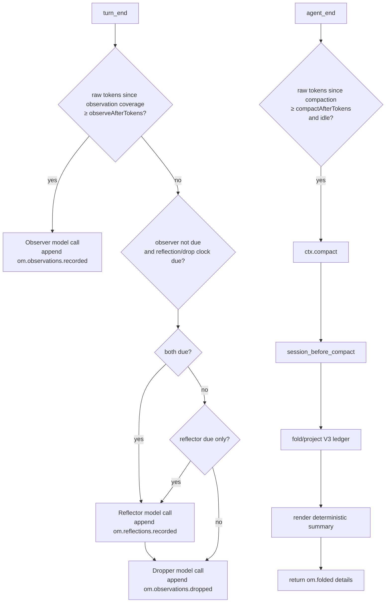

# How it works

This is the V3 technical reference for `pi-observational-memory`.

V3 is ledger-centered: memory state is reconstructed by folding V3 ledger entries on the current branch. Compaction is model-free and renders a projection of that ledger into the summary the agent sees.

## Runtime entry points

`src/index.ts` registers one shared runtime and these Pi surfaces:

| Surface | Purpose |
|---|---|
| `turn_end` observer trigger | Maybe run the observer in the background. |
| `turn_end` reflect/drop trigger | Maybe run the due reflector and/or due dropper in one background lane. |
| `agent_end` compaction trigger | Maybe call `ctx.compact()` when idle and over `compactAfterTokens`. |
| `session_before_compact` hook | Build the V3 compaction payload deterministically. |
| `/om-status` | Show ledger counts, drift, progress clocks, and worker state. |
| `/om-view` | Show visible/full/diff memory projections. |
| `recall` tool | Recover source evidence for a memory id. |

## Lifecycle overview



The observer has priority. Reflect/drop does not run on a turn where observer work is due.

## Source entries and progress

V3 raw-token progress counts only source entries:

- `message`
- `custom_message`
- `branch_summary`

Memory ledger entries and compaction entries do not add raw-token progress.

Every V3 ledger entry has `data.coversUpToId`. That field is a progress watermark. Worker clocks count raw/source tokens after the latest valid watermark for that worker's ledger type:

| Worker/trigger | Progress source |
|---|---|
| Observer | latest `om.observations.recorded.data.coversUpToId` |
| Reflector | latest `om.reflections.recorded.data.coversUpToId` |
| Dropper | latest `om.observations.dropped.data.coversUpToId` |
| Auto-compaction | latest compaction boundary |

The watermark is not provenance. Provenance lives in `sourceEntryIds` and `supportingObservationIds`.

## Ledger data shapes

### Observations recorded

```ts
customType: "om.observations.recorded"
data: {
  observations: Observation[];
  coversUpToId: string;
}
```

Each observation:

```ts
type Observation = {
  id: string;
  content: string;
  timestamp: string;
  relevance: "low" | "medium" | "high" | "critical";
  sourceEntryIds: string[];
  tokenCount: number;
}
```

The builder rejects empty observation arrays, so no empty progress entries are written.

### Reflections recorded

```ts
customType: "om.reflections.recorded"
data: {
  reflections: Reflection[];
  coversUpToId: string;
}
```

Each reflection:

```ts
type Reflection = {
  id: string;
  content: string;
  supportingObservationIds: string[];
  tokenCount: number;
}
```

The reflector must cite valid active observation ids.

### Observations dropped

```ts
customType: "om.observations.dropped"
data: {
  observationIds: string[];
  coversUpToId: string;
}
```

Drops are tombstones. They remove ids from active observations but do not delete ledger history.

### Folded compaction details

```ts
details: {
  type: "om.folded";
  version: 1;
  fullFold: boolean;
  observations: Observation[];
  reflections: Reflection[];
}
```

These details are what later visible projections read. The ledger remains the source of truth.

## Observer flow

The observer trigger runs on `turn_end`.

1. Load config if needed.
2. Skip if `passive` is true.
3. Skip if `observerInFlight` is true.
4. Count raw/source tokens since latest observation coverage.
5. Skip if below `observeAfterTokens`.
6. Select source entries after the latest observation coverage marker.
7. Serialize those source entries for the observer prompt.
8. Resolve the memory model.
9. Run `runObserver()` in a background task.
10. Validate source ids returned by the model.
11. Compute deterministic 12-character ids and per-observation token counts in code.
12. Append `om.observations.recorded` only if at least one observation was accepted.

If no observations are generated, the worker writes no entry and does not advance coverage. A later eligible observer run will see a larger range.

## Reflect/drop flow

Reflect/drop also runs on `turn_end`, but only when the observer is not due.

1. Load config if needed.
2. Skip if `passive` is true.
3. Skip if observer or reflect/drop work is already in flight.
4. Skip if observer progress has reached `observeAfterTokens`.
5. Check reflector and dropper raw-token clocks against `reflectAfterTokens`.
6. Resolve the model once.
7. Fold current ledger state.
8. If reflector is due and observation coverage exists, run the reflector.
9. Append non-empty `om.reflections.recorded` with `coversUpToId` set to the latest observation coverage marker.
10. If dropper is due, run the dropper after reflector. It can see same-turn reflections.
11. Append non-empty `om.observations.dropped` with `coversUpToId` set to the earlier branch position of latest observation coverage and latest effective reflection coverage. If no reflection coverage exists yet, dropper bootstraps to observation coverage.

Reflector failure skips same-turn dropper when both were due. Dropper failure does not roll back already-appended reflections.

## Auto-compaction trigger

The auto-compaction trigger runs on `agent_end`.

It skips when:

- `passive` is true;
- compaction is already in flight;
- the agent end event is a retryable error;
- raw/source tokens since last compaction are below `compactAfterTokens`;
- Pi is not idle after the deferred check;
- the threshold is no longer met after the deferred check.

When all checks pass, it calls `ctx.compact()`.

This trigger does not wait for observer, reflector, or dropper promises. That is intentional: background memory work should never make compaction feel stuck.

## Compaction hook

The compaction hook runs on `session_before_compact` and is the critical V3 latency path.

It does only deterministic work:

1. Guard against duplicate concurrent compaction hooks.
2. Load config if needed.
3. Read `event.preparation.firstKeptEntryId` and `event.preparation.tokensBefore`.
4. Build a compaction projection from branch entries and `firstKeptEntryId`.
5. Render a summary from projected reflections and observations.
6. Return `{ compaction: { summary, firstKeptEntryId, tokensBefore, details } }` where `details.type` is `om.folded`.

It does not:

- call a model;
- run a sync observer;
- run reflector/dropper;
- wait for worker promises;
- append ledger entries.

If another compaction hook is already in flight, it returns `{ cancel: true }`.

## Projections

V3 uses projection helpers so commands, compaction, and recall do not each invent their own truth.

### Full projection

Full projection folds valid V3 observations, reflections, and drops from branch root through the requested boundary. Old V2 entries/details and invalid V3-shaped entries are ignored.

### Visible projection

Visible projection without a boundary reads the latest V3 `om.folded` compaction details. This is what the agent currently sees.

### Compaction projection

When compaction runs, the projection helper decides whether this compaction is a full fold. It sums visible active observation `tokenCount`; if that total is at or above `observationsPoolMaxTokens`, it performs a full fold through `firstKeptEntryId`. Otherwise, it projects new observations while keeping reflection/drop effects stable from the latest full fold.

### Diff projection

Diff projection compares visible memory with full memory. `/om-view diff` uses this to show drift.

## Summary rendering

The renderer returns an empty string when there are no visible observations or reflections. Otherwise it renders:

```md
These are condensed memories from earlier in this session.

## Reflections
[id] durable reflection

## Observations
[id] YYYY-MM-DD HH:MM [relevance] timestamped observation
```

The renderer is deterministic. It does not call a model and does not rewrite memory content.

## Commands

### `/om-status`

Shows:

- active/dropped observation counts;
- reflection count;
- visible projection size;
- visible-vs-full drift;
- next observation/reflection/drop/compaction token progress;
- full-fold pool pressure;
- passive mode;
- worker in-flight flags;
- last observer and reflect/drop errors.

### `/om-view`

Default mode shows visible memory.

### `/om-view full`

Shows full V3 ledger truth at branch tip.

### `/om-view diff`

Shows visible-vs-full drift.

## Recall flow

The agent-facing `recall` tool accepts a 12-character lowercase hex id.

1. Validate id shape.
2. Read the current branch.
3. Index V3 observations, reflections, and drops from ledger history.
4. Match the id against observations and reflections.
5. For observations, mark status as `active` or `dropped`.
6. Resolve observation source entries from `sourceEntryIds`.
7. For reflections, resolve supporting observations and their sources.
8. Return exact evidence plus diagnostics for missing/non-source entries.

Recall ignores old V2 memory by construction because it indexes only V3 ledger entry types.

## Error and race handling

- Worker in-flight flags prevent duplicate observer or reflect/drop runs.
- Observer priority prevents reflect/drop from advancing while source text is due for observation.
- No-output workers append no empty ledger entries.
- Invalid source/support/drop ids are filtered or rejected by code.
- Background worker errors are recorded on runtime state and surfaced in `/om-status`.
- Compaction does not wait for background workers; it folds whatever ledger state is already present.
- Historical or invalid coverage markers are tolerated by progress helpers instead of throwing.

## V2 behavior

V3 does not use V2 state shapes. Old V2 custom memory entries, old V2 compaction details, and old V2 config keys are ignored. Existing old visible compaction text in a continued session may remain visible until a V3 compaction replaces it. The recommended upgrade path is to update settings and start a new clean session.

## Invariants

- The branch-local V3 ledger is the memory source of truth.
- Pi compaction summaries represent what the agent sees.
- Compaction is deterministic and model-free.
- Observer input is raw/source entries only.
- `coversUpToId` is a progress watermark, not provenance.
- Kept observations and reflections are rendered without paraphrase.
- Dropped observations remain recallable from ledger history.
- Old V2 memory is ignored rather than migrated.
